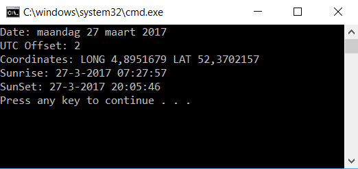

# Sunrise and sunset calculation in C#

Heavily cleaned up and simplified C# library to calculate the sunrise and sunset for a location on earth on any given date. Compiled for .NET 4.6.2 and signed assemblies.

## Usage

```C#
// Date for which to calculate the sunrise and sunset
var date = DateTime.Today;

// Latitude for which to calculate the sunrise/sunset
var latitude = 52.3702157;

// Longitude for which to calculate the sunrise/sunset
var longitude = 4.8951679;
            
// Hours from UTC which this location is in
var utcOffset = TimeZone.CurrentTimeZone.GetUtcOffset(DateTime.Now).Hours;

// Write the output to the screen
Console.WriteLine("Date: " + date.ToLongDateString());
Console.WriteLine("UTC Offset: " + utcOffset);
Console.WriteLine("Coordinates: LONG " + longitude + " LAT " + latitude);
Console.WriteLine("Sunrise: " + SunSetRiseLib.SunriseAt(latitude, longitude, date, utcOffset));
Console.WriteLine("SunSet: " + SunSetRiseLib.SunsetAt(latitude, longitude, date, utcOffset));
```



## NuGet

Also available as NuGet Package: [KoenZomers.SunSetRise](https://www.nuget.org/packages/KoenZomers.SunSetRise)

## Version History

Version 1.1.2.1 - October 8, 2017

Minor update to return a NULL when the sunset or sunrise can't be calculated based on the provided lat or long in combination with the timezone. Before it would throw an exception instead.

Version 1.1.2.0 - August 16, 2017

Minor update just to accommodate the NuGet package name change to get it aligned with my other NuGet packages

Version 1.1.1.0 - March 27, 2017

Changed namespace of code to make it look cleaner when used

Version 1.1.0.0 - March 27, 2017

Initial version as forked. Cleaned up code, compiled against .NET 4.6.2 and signed the assemblies.

## Credits

Forked from https://github.com/sely2k/SunSetRiseLib

## Feedback

Comments\suggestions\bug reports are welcome!

Koen Zomers
mail@koenzomers.nl
